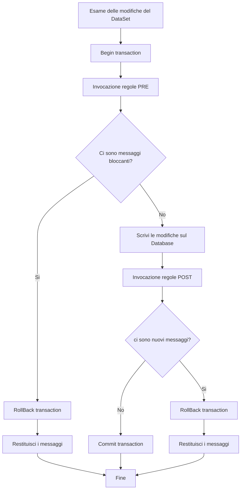

# Business Logic

La classe jsBusinessLogic si occupa dell'invocazione delle regole di business.

Volendo fare una panoramica, la classe [PostData](PostData.md) è la classe che salva i dati, in generale,
 e di suo si limita a chiamare il proprio metodo getBusinessLogic, che di default 
 restituisce un oggetto di tipo IBusinessLogic, che in pratica non effettua alcun controllo sui dati.

La classe IBusinessLogic infatti espone un metodo getChecks che serve a calcolare le regole di business
dato un set di modifiche al database, ma nella sua versione base non calcola nulla.

La classe BusinessPostData, che deriva dalla classe PostData, invece, calcola le regole di business. 
E lo fa ridefinendo il metodo getBusinessLogic in modo da restituire un'istanza della classe jsBusinessLogic
 invece dell'originario IBusinessLogic.

### Schema di salvataggio

### Come calcola jsBusinessLogic i messaggi (regole)?

Il calcolo consiste nell'invocare delle stored procedure, prima e dopo il salvataggio del DataSet,
ma sempre in modo tale che tutto avvenga all'interno di una transazione.

Pertanto se dovessero risultare delle violazioni delle regole la transazione sarà annullata completamente.

 Ogni stored procedure si riferisce ad una tabella e ad un tipo di operazione, ed è in genere calcolata da un tool
 che forniamo a parte e che si basa sulle tabelle audit e auditcheck per trasformare del codice enriched-sql 
 in stored procedure altamente ottimizzate.
 E' comunque possibile scrivere a mano tali stored procedure, rispettando il formato che segue:
 
## tabella audit
Contiene la descrizione delle varie regole da applicare, in particolare:

- idaudit contiene il codice della regola
- severity (W/E/I) W se messaggio ignorabile, E se errore bloccante, I se regola disabilitata
- title è il nome della regola

Le regole sono restituite al client per poterle mostrare all'utente, che avrà la facoltà, ove siano tutte 
ignorabili, di ignorarle e riprovare il salvataggio. Le regole precedentemente ignorate saranno quindi 
passate nuovamente al server insieme ai dati da salvare, e l'operazione si concluderà se nel frattempo non 
vi siano presentati nuovi messaggi che l'utente non ha ancora avuto modo di vedere.

Pertanto l'input del processo di salvataggio è dato dal set di dati da salvare (DataSet) unito ai messaggi
 eventualmente ignorati in precedenza.

## tabella auditcheck

Contiene i controlli sulle singole tabelle e operazioni, suddivisi tra "pre" e "post".

I campi sono i seguenti:
- idaudit codice della regola (chiave di audit)
- idcheck chiave aggiuntiva intera (usata nelle stored procedure)
- opkind tipo operazione (I/U/D)
- tablename nome tabella
- flag_both, flag_cash, flag_comp (S/N): flag per indicare il tipo di contabilità in alcuni programmi
- flag_credit, flag_proceeds (S/N): altri flag per indicare il tipo di gestione
- precheck (S/N): S se controllo "pre", N se controllo "post" (vedasi flowchart)
- message messaggio di errore da visualizzare se la regola è violata
- sqlcmd comando pseudo-sql da eseguire per verificare la violazione della regola

message può contenere campi della tabella indicata tablename o di tabelle parent di essa nel dataset
 che si sta salvando. In questo caso saranno sostituiti dai valori delle righe collegate.
I campi nel messaggio devono essere scritti nel formato %<tabella.campo>%

sqlcmd è una condizione sql booleana che deve risultare vera affinché la regola non risulti violata.
Da questo punti di vista la si può considerare una specie di ASSERT di molti tool di testing.
Nel sqlcmd possono comparire campi della tabella tablename nella forma:

- %<tabella.campo>% per indicare il valore corrente del campo
- &<tabella.campo>& solo nelle operazioni di update, per indicare il valore precedente del campo

Se si vuole salvare (per motivi di efficienza, è vivamente consigliato), il risultato di una 
 sotto-espressione ai fini di riutilizzarla nello stesso sqlcmd o in quello di altri sqlcmd 
 relativi alla stessa tabella/operazione/precheck(S/N) è possibile racchiuderla tra parentesi 
 quadre seguite da una coppia di parentesi graffe che racchiudono il tipo di operazione, che potrà
 essere I per intero, R Real, C varchar(255), D DateTime, V decimal(23,2), N decimal (23,6)

E' possibile anche utilizzare variabili d'ambiente dell'utente (vedasi jsEnvironment) nella forma:

- %<sys_variablename>% per le variabili di ambiente di tipo sys
- %<usr_variablename>% per le variabili di ambiente di tipo usr

Ad esempio sqlcmd potrebbe valere:
[select count(*) from account where ayear= %<accmotivedetail.ayear>%+1]{I} =0

E' possibile anche effettuare la chiamata ad una stored procedure che abbia come output una variabile di output,
a patto che questa si chiami @outvar e si usi l'istruzione execute come segue a titoli di esempio:

[execute count_table_field 'parasubcontract','idaccmotive', %<accmotive.idaccmotive>%,@outvar output]{I}=0
and
[execute count_table_field 'parasubcontract','idaccmotivedebit',
%<accmotive.idaccmotive>%,@outvar output]{I}=0

Queste indicazioni sono valide se si usa il tool che compila le stored procedures a partire dalle tabelle audit e 
 auditcheck della Tempo Srl, che funziona per i db Sql Server.

Altrimenti si possono scrivere le stored procedure a mano o con altri sistemi.

BusinessLogic invocherà le stored procedure con le seguenti convenzioni:

1) la stored procedure si deve chiamare check_[tablename]_[I|U|D]_[pre|post] dove I/U/D sono le iniziali
 dell'operazione a cui si applica la stored (Insert/Update/Delete), e pre/post vanno usate a seconda che la regola sia 
 "pre" o "post" (vedasi flowchart) 

2) la stored procedure avrà i parametri indicati dalla tabella auditparameter di cui in seguito

3) la stored procedure restituirà un tipo intero o varchar a seconda di quanti controlli sono presenti in essa:

- da 1 a 14: SMALLINT
- da 15 a 40: INT
- da 31 a 62: BIGINT
- da 63 in poi: VARCHAR(N) ove N è il numero dei controlli

per i tipi interi, ogni bit rappresenta il numero di un controllo, a partire dal bit meno significativo.
Per il tipo varchar, ogni posizione può valere S o N, ove S indica la presenza di un errore nel controllo 
 corrispondente a quella posizione.

le posizioni dei messaggi così ottenute sono usate come indici per accedere all'array di righe che si ottiene
 elencando le righe della vista auditcheckview ordinando per idaudit ASC, idcheck ASC e filtrando solo le righe attive
 ossia filtrando severity <> 'I' and sqlCmd is not null

da tali righe sarà preso il campo message, dopo aver sostituito le sottostringhe nel formato %<tabella.campo>% con i 
 campi corrispondenti, come precedentemente indicato.
I controlli saranno o meno bloccanti a seconda del valore del campo severity (se severity = 'E' sono errori bloccanti). 

## Tabella auditparameter

Indica i parametri con cui le sp di check sono invocate. 
Ha i seguenti campi:

- isprecheck: S se si riferisce ad una SP "PRE", altrimenti N, come da auditcheck
- opkind: I/U/S come da auditcheck
- tablename: tabella a cui si riferisce
- parameterid: numero del parametro per nel passaggio dei parametri
- flagoldvalue (S/N), S per le operazioni di modifica in cui si richiede il valore precedente della riga,
 altrimenti sarà passato il valore corrente
- paramtable: è la tabella da cui prendere il campo. Deve tassativamente coincidere con tablename.
- paramcolumn: è la colonna di cui si richiede il valore

È importante capire che il corretto funzionamento della stored procedure dipende dai parametri che le 
 si passano, che devono corrispondere ai valori nel dataset delle righe di cui si sta richiedendo la 
 verifica. Tali valori non sono ancora stati scritti nel db, quindi vanno presi dal DataSet. 

**L'invocazione delle stored procedure dei messaggi e la decodifica dei messaggi è interamente a carico 
 della classe BusinessLogic quindi è bene capirne la logica ma non sarà necessario implementarla.**

Tuttavia se si intende scrivere le stored procedure in autonomia queste dovranno conformarsi alle convenzioni suddette
 se si intende utilizzare la classe jsBusinessLogic.

## vista auditcheckview

è una semplice join di audit e auditcheck con tutti i campi di auditcheck ed in più title e severity di audit
