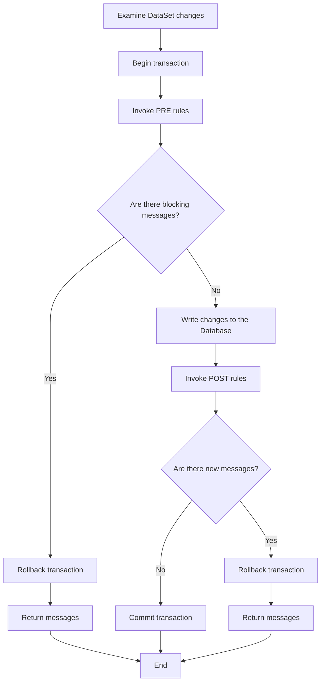

[](https://github.com/TempoSrl/myKode_Backend/tree/main/jsBusinessLogic.it.md)

# Business Logic

The `jsBusinessLogic` class is responsible for invoking business rules.

In overview, the [PostData](PostData.md) class is the class that saves data in general and, by default, simply calls its `getBusinessLogic` method, which, in turn, returns an object of type `IBusinessLogic`. In practice, `IBusinessLogic` does not perform any data checks.

The `IBusinessLogic` class exposes a `getChecks` method used to calculate business rules given a set of database changes. However, in its base version, it doesn't calculate anything.

On the other hand, the `BusinessPostData` class, derived from the `PostData` class, does calculate business rules. It does so by redefining the `getBusinessLogic` method to return an instance of the `jsBusinessLogic` class instead of the original `IBusinessLogic`.

### Save Schema



### How does `jsBusinessLogic` calculate messages (rules)?

The calculation involves invoking stored procedures, both before and after saving the DataSet, but always ensuring that everything happens within a transaction. Therefore, if there are rule violations, the transaction will be completely rolled back.

Each stored procedure refers to a table and a type of operation, and is usually calculated by a tool we provide separately. 
This tool is based on the audit and auditcheck tables to transform enriched-sql code into highly optimized stored procedures. 
However, it is possible to write these stored procedures manually, adhering to the format described below.

## audit table
Contains descriptions of various rules to apply, including:

- `idaudit`: code of the rule
- `severity` (W/E/I): W if the message is ignorable, E if it is a blocking error, I if the rule is disabled
- `title`: name of the rule

The rules are returned to the client to display to the user. The user has the option to ignore them if they are all ignorable, 
and retry the save operation. Previously ignored rules are then sent back to the server with the data to be saved. 
The operation concludes if no new messages that the user has not yet seen are presented.

Therefore, the input to the save process consists of the set of data to be saved (`DataSet`) combined with the messages previously ignored.

## auditcheck table
Contains checks on individual tables and operations, divided into "pre" and "post".

The fields are as follows:
- `idaudit`: rule code (audit key)
- `idcheck`: additional integer key (used in stored procedures)
- `opkind`: operation type (I/U/D)
- `tablename`: table name
- `flag_both`, `flag_cash`, `flag_comp` (S/N): flags to indicate the type of accounting in some programs
- `flag_credit`, `flag_proceeds` (S/N): other flags to indicate the type of management
- `precheck` (S/N): S for "pre" check, N for "post" check (see flowchart)
- `message`: error message to display if the rule is violated
- `sqlcmd`: pseudo-SQL command to execute to check the rule violation

The `message` field may contain fields from the table indicated by `tablename` or from its parent tables in the dataset being saved. In this case, they will be replaced by the values of the linked rows. Fields in the message must be written in the format `%<table.field>%`.

`sqlcmd` is a boolean SQL condition that must be true for the rule not to be violated. From this perspective, it can be considered a kind of ASSERT from many testing tools. In `sqlcmd`, fields from the `tablename` table can appear in the form:

- `%<table.field>%` to indicate the current value of the field
- `&<table.field>&` only in update operations, to indicate the previous value of the field

If you want to save (for efficiency reasons, it is strongly recommended) the result of a sub-expression for reuse in the same `sqlcmd` or in that of other `sqlcmd` related to the same table/operation/precheck(S/N), you can enclose it in square brackets followed by a pair of curly braces that enclose the type of operation, which can be I for integer, R for real, C varchar(255), D DateTime, V decimal(23,2), N decimal (23,6).

It is also possible to use user environment variables (see jsEnvironment) in the form:

- `%<sys_variablename>%` for sys-type environment variables
- `%<usr_variablename>%` for usr-type environment variables

For example, `sqlcmd` could be:
```
[select count(*) from account where ayear= %<accmotivedetail.ayear>%+1]{I} =0
```

It is also possible to call a stored procedure that has an output variable, provided that it is named @outvar and the execute statement is used as follows for example purposes:

```
[execute count_table_field 'parasubcontract','idaccmotive', %<accmotive.idaccmotive>%,@outvar output]{I}=0
and
[execute count_table_field 'parasubcontract','idaccmotivedebit',
%<accmotive.idaccmotive>%,@outvar output]{I}=0
```

These guidelines are valid if you use the tool that compiles stored procedures from the Tempo Srl audit and auditcheck tables, which works for Sql Server databases. Otherwise, you can write stored procedures manually or with other systems.

BusinessLogic will invoke stored procedures following these conventions:

1) The stored procedure must be named check_[tablename]_[I|U|D]_[pre|post], where I/U/D are the initials of the operation to which the stored procedure applies (Insert/Update/Delete), and pre/post should be used depending on whether the rule is "pre" or "post" (see flowchart)

2) The stored procedure will have parameters indicated by the auditparameter table described below

3) The stored procedure will return an integer or varchar type depending on how many checks are present in it:

- from 1 to 14: SMALLINT
- from 15 to 40: INT
- from 31 to 62: BIGINT
- from 63 onwards: VARCHAR(N) where N is the number of checks

For integer types, each bit represents the number of a check, starting from the least significant bit. For varchar types, each position can be S or N, where S indicates the presence of an error in the

corresponding check position.

The positions of the messages obtained in this way are used as indices to access the array of rows obtained by listing the rows of the auditcheckview view ordering by idaudit ASC, idcheck ASC and filtering only active rows (filtering severity <> 'I' and sqlCmd is not null).

From these rows, the `message` field will be taken after replacing the substrings in the format `%<table.field>%` with the corresponding fields, as previously indicated. The checks will or will not be blocking depending on the value of the `severity` field (if `severity = 'E'`, they are blocking errors).

## auditparameter table
Indicates the parameters with which the check stored procedures are invoked. It has the following fields:

- `isprecheck`: S if it refers to a "PRE" SP, otherwise N, as per auditcheck
- `opkind`: I/U/S as per auditcheck
- `tablename`: table to which it refers
- `parameterid`: number of the parameter for passing parameters
- `flagoldvalue` (S/N): S for modification operations that require the previous value of the row, otherwise the current value will be passed
- `paramtable`: the table from which to take the field. It must strictly coincide with tablename.
- `paramcolumn`: the column whose value is requested

It is important to understand that the correct functioning of the stored procedure depends on the parameters passed to it, which must correspond to the values in the dataset of the rows being requested for verification. These values have not yet been written to the database, so they must be taken from the DataSet.

**The invocation of message stored procedures and the decoding of messages are entirely the responsibility of the BusinessLogic class, so it is good to understand the logic but it will not be necessary to implement it.**

However, if you intend to write stored procedures independently, they must adhere to the conventions mentioned above if you intend to use the `jsBusinessLogic` class.

## auditcheckview view

It is a simple join of `audit` and `auditcheck` with all fields from `auditcheck` and in addition, `title` and `severity` from `audit`.
